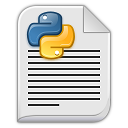

# Learning Python 
> Python is a scripting language like PHP, Perl, Ruby and so much more. It can be used for web programming (django, Zope, Google App Engine, and much more). 

Whether you are an experienced programmer or not, this repo is intended for everyone who wishes to learn the Python programming language.

## What we learn 
- Print "Hello World"
- Conditions
- Whileloops
- functions
- Prime Numbers Generator (Using Functions)
- Fibonacci Series (Using Functions and Class)
- Inheritance, Polymorphism
- MVC (Model View Controller)

## Contribute

Contributions are always welcome!
Please read the [contribution guidelines](contributing.md) first.
